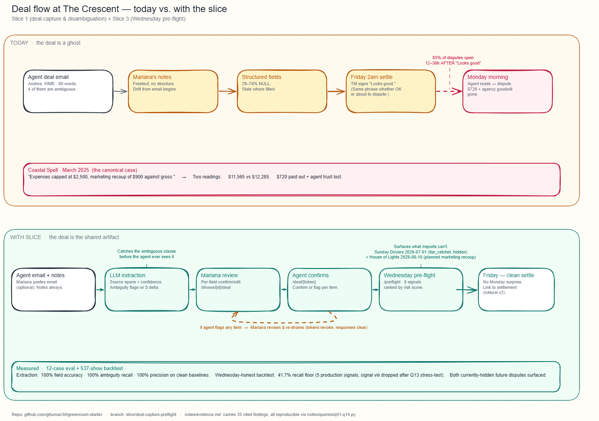

# Settlement at The Crescent
Slice 1 (deal capture & disambiguation) + Slice 3 (Wednesday pre-flight)
Arshdeep Ghuman · Applied AI PM case · May 2026

## What's actually broken
Mariana, lead booker at The Crescent for six years: *"The 2am ritual is the worst part of every week."*
The pain isn't the math. The math is the easy part. The pain is:
- Pulling expenses together from four systems on Wednesday for a Friday show
- Settling at 2am with a tour manager who signs "Looks good" no matter what
- Emailing the agent the statement Saturday morning
- **Reading their dispute email Monday at 10am** — about an ambiguous clause in a deal email written at 11pm in December
Three of four interviews independently call it the same thing. Sarah Kim at WME named it best: *"The deal was a ghost."* This is a **trust problem**, and the trust breaks upstream of the math.

## Reading past the badge — six findings that shaped the design
| **What the data actually says** | **What it meant for the design** |
|---|---|
| **Briar Road's `deal_notes_freetext` contains Mariana's own warning:** she flagged her own data drift inside the prose because no amendment mechanism exists. (D9) | The slice's spine is **prose as source of truth + LLM extraction + agent confirmation + amendment versioning.** Structure follows prose. |
| **The state machine has two concepts of "signed" that disagree.** `signed_at` is NULL on 23 of 24 disputed shows. But `signoff_text` says "Looks good" / "OK. Good night." / 👍 . The actual dispute opens 12–36h later. (D1, D10) | Add HITL gate with **three states:** confirmed / reviewed-with-flags / not-sent. Aggregate response row's `action` field encodes the outcome explicitly. |
| *The Coastal Spell record carries the *resolved* number, but its status still says `disputed`.* | Don't blindly trust any single field. Mariana's review surface shows extraction + agent responses + signoff state side by side, never one as proxy for another. |
| **The dashboard hides 29 future-dated settlements, including 2 in-flight disputes.** | `/preflight` reads the **un-filtered** database via a dedicated `lib/preFlightQueries.ts` — not the existing helpers. |
| **94 recoup line items at settlement with no deal note.** Marketing recoup dominates (56 of 94). Yet the word "recoup" appears in *only 1 of 537* deal_notes_freetext entries. Recoups live in negotiation, not in writing. (D2) | Predicts using **agent + agency historical recoup rate**. If Pat Cho's past shows have ≥40% recoup rate at settlement and the current deal mentions none, the pre-flight flags it. |
| **`agents.preferences_notes` is dense relationship intelligence the product never uses.** Seven of fourteen agents have notes — and these seven are the ones Mariana has formed operational opinions on. (D29) | Two design moves. **(1)** Per-agent banner pinned at the top —  warnings as context for the current deal. **(2)** Rank Agent severity based on preference notes. Daniel + ambiguity = high severity; Danny Ortiz + same ambiguity = low. |

## My bet (one line)
These six findings argue one thing: replace "deal as a ghost" with **"deal as the shared artifact"** — structured by an LLM from Mariana's notes (and optionally the agent's email), confirmed by the agent before show, and watched by a Wednesday pre-flight that catches the issues the dashboard can't see.

*Figure 1 · The deal flow today (top) vs. with the slice (bottom).*

## The slice (one shared object, three surfaces)
| **Surface** | **Route** | **What it does** | **Who reads it** |
|---|---|---|---|
| Mariana review | `/shows/[id]/deal` | LLM-extracted deal side-by-side with prose, source spans, per-field confidence, ambiguity flags with $ delta. Agent's `preferences_notes` pinned as context. | Booker |
| Agent confirmation | `/deal/[token]` | Plain-English restatement. Per-item confirm/flag. Two-reading picker on ambiguity. No Greenroom account required. | Agent |
| Wednesday pre-flight | `/preflight` | Upcoming shows ranked by 8 risk signals. Reads the un-filtered DB. | Booker |

## Tradeoffs I made
| **Choice** | **What I picked** | **What I gave up** | **Why** |
|---|---|---|---|
| Win condition | Cut dispute volume + flagship agency trust | Move the 18% in-app-usage number (A) | Pri's memo names the 18% as a *symptom* of the trust problem, not the goal. Marcus' lease-renewal logic depends on agency relationships. Picking A → vs-deal calculator → repeats the "comprehensive but mediocre" mistake. |
| Persona model | Single deal artifact, multiple views (Mariana / agent / TM-mobile-readable) | Three separate persona-specific products | Cuts build cost ~30% vs full multi-persona. Architectural insight: it's one *artifact* with views, not three products. Sarah's three asks from `sarah-kim.md:55` collapse into one object. |
| HITL granularity | Per-item confirm/flag + ambiguity-reading | "Confirm all" single button | The single-button design is what produces the dispute (TM signs "Looks good" at 2am, agent objects Monday). The whole point is to make objection *cheap and granular* before show. |
| LLM scope | LLM only on signal (i) — semantic ambiguity reading | LLM as the substrate for everything | Signals (ii)–(v) are deterministic SQL/regex over history. They don't need an LLM. AI as substitution for judgment, not amplification. |

## What I cut
| **Cut** | **Why** |
|---|---|
| **Vs-deal calculator** | 62% of deals are unsupported by the current engine. Tempting. Pri's memo diagnoses Greenroom as *winning on completeness, losing on craft*. Adding deal-math types is more completeness. The trust isn't built at the calculator — it's built at the deal email and the morning-after read. |
| **2am settlement walkthrough UI** | Downstream of unambiguous deals. Diego the TM described the good cases as *"20 minutes max"* when the booker has it together. The fix isn't a better walkthrough — it's not having things to argue. |
| **Dispute resolution workflow** | Lagging indicator. The brief explicitly points upstream. |
| **Full settlement statement as shared doc** | Sarah Kim's third ask. The natural v2 — the spine I built is what makes it cheap to add. |
| **Audit trail of the 2am conversation** | If the in-room signoff is already theatre, capturing more theatre is more theatre. |

## What I measured
**(1) The LLM extraction works.** Hand-labeled 12 cases (`notes/eval_set_with_labels.json`) spanning hero cases, clean baselines, agency mix, structural variety. Ran the extractor against `openai/gpt-oss-120b:free`. Got 100% field accuracy, 100% ambiguity recall, 100% precision on clean baselines, 100% planned-recoup recall. JSON validity ~92% per run on free-tier (retry-once gets ~99%; paid-tier with deterministic sampling gets ~100%).
**(2) Wednesday prevention works on past disputes.** Ran the 5 Wednesday-honest production signals against all 24 historical disputes (`notes/queries/q11_backtest_corrected.py`). Got **41.7% recall** (10/24), 8.1% precision, 23.6% fire-rate on paid shows. The miss-cases are mostly deal-type-level risk (vs/% of net with no surface ambiguity).
**(3) The LLM upgrade has a measured floor and a projected ceiling. The lift requires full corpus coverage.** "Lift" here means *how much extraction quality moves the backtest recall*. Today only 12 of 537 deals have an LLM extraction populated (the eval set). At that 2% coverage, swapping regex signal (i) for LLM-extracted ambiguity matches regex recall (10/24) while trimming 2 false positives — a small precision win. In production, extraction runs on every deal entry, so coverage starts at 100%. **The number I'd defend is 41.7%; the projected lift toward 60–70%**.

## Assumptions I'm making (and what breaks if they're wrong)
| **Assumption** | **If wrong, what breaks** |
|---|---|
| Mariana enters marketing/production expenses **before show** | Signal (iii.pred) loses signal. Mariana's quote suggests this is true for marketing (campaigns paid at launch) and false for hospitality (post-show realization). Signal (iii.pred) is history-based. |
| Agents will actually click confirmation links | If <50% engagement, the agent-confirm gate becomes noise; pre-flight signal (vi) fires on most upcoming shows; trust degrades. Mitigation: track click-through over 30 days. |
| `preferences_notes` is maintained by Mariana | If it's stale or wrong, agent severity modifier mis-scales signals. Today 7/14 agents have notes; ones with operational history (D34), suggesting Mariana writes them when she has an opinion. |
| Free-tier `gpt-oss-120b:free` quality holds for production scale | If quality degrades or rate-limits hit, fall back to paid-tier (`anthropic/claude-sonnet-4.5` ~$0.003/extraction, ~$50/venue/yr at scale). |

## Questions I'd ask in real life — and how the answers would change what I'd build
**To Sarah Kim (WME):** *"If Mariana drops a hospitality cap by $50 vs. changes the bonus threshold by $5k after the original email, where's the line for 'material' for you?"* → Drives whether amendment versioning triggers re-confirmation on every change or material-only. Current default: every change.
**To Mariana:** *"If the LLM extracts your deal and 1 of 10 fields is wrong, do you want (a) a per-field alert, (b) re-do the whole extraction, or (c) edit inline?"* → Today the UI offers (c) per-field edit. If she wants (a), the review page needs a focused "needs attention" list before the side-by-side view. If (b), the trigger-extraction button needs an "undo" path.
**To Diego the TM and Sarah:** *"If the pre-flight surfaces a risk on Wednesday, do you also want a Friday-morning refresh, or is Wednesday enough?"* → Whether pre-flight is one-shot or daily-until-show. Affects build + email cadence.
**To Marcus (GM):** *"If we send the agent a confirmation link and they don't act on it before show, what's the venue policy? Ship as-extracted? Pause settlement? Default to most-conservative reading?"* → Default state when the agent ghosts. Today the deal stays unconfirmed and pre-flight keeps firing.

## What I'd ship next, in order
1. **Settlement statement as a shared document** — same agent-confirm pattern, post-show artifact. `calculation_json` slot is already there (537/537 NULL today — finding D11). Closes Sarah Kim's three-asks loop.
1. **Forward-to-address email ingest** (`deals@<venue>.greenroom.io`) — removes the optional paste step. Architecture doesn't change.
1. **Agent identity verification on confirmation links** — magic-link to verified agent email, or agency SSO. Current model is trust-by-possession; documented in `docs/ISSUES.md`.
1. **Per-agent settlement templates** — Tom Neary wants his own format; Sarah Kim hates `"Misc"` line items (both from `preferences_notes`). Pure presentation layer; meaningful relationship win.
1. **Full-corpus extraction backfill** — converts the projected LLM lift into a measured one.

**Repo:** github.com/ghuman30/greenroom-starter · branch `slice/deal-capture-preflight`
